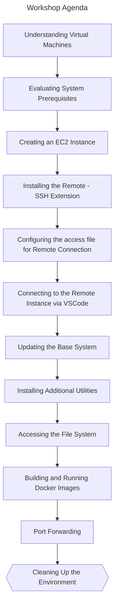

## 🚀 Welcome to Use AWS EC2 as your Personal Computer Workshop

In this workshop you would experience creating a virtual machine from scratch. Now, we would start by diving down the AWS console and then we would go on to create a Linux VM on EC2 with help of asymmetric encryption and then connect it with the loved VSCode. 

By the end, you would be able to run your workloads directly on EC2 via VSCode and use it for development purposes

### 📖 About This Workshop

This is L100-200 workshop and specifically structured for developers from any levels. Knowledge on what SSH, Docker is should be helpful! This workshop is for the [AWS Community Days Singapore 2023](https://www.awsugsg.dev/).

### 💡 Context 

Two years ago, I began my journey in the technology industry by learning development and DevOps. However, I encountered a problem during this process. The internet bandwidth in India was not sufficient, which resulted in extremely slow download speeds for Docker images. This made it take a very long time for the images to be pulled and made it difficult for me to efficiently learn and work with the technology.

One of the easiest solutions I found to overcome the issue of slow internet speeds was to utilize a cloud virtual machine (VM) through student programs. By doing so, I was able to use the VM as my personal computer. This approach had several benefits, such as improved performance and faster internet speeds.

By running a VM in the cloud, I was able to access the resources of a powerful computer and avoid the limitations of my local machine. Additionally, the cloud-based VM allowed me to access my development environment from anywhere, which provided greater flexibility and convenience. 

Currently, there are more container-based solutions available in the market that can perform better in certain scenarios. However, virtual machines (VMs) continue to be a useful option for some because of their ability to run applications which require virtualization like VirtualBox like MiniKube and also satisfy memory and CPU, GPU requirements which containers fail to address. 


### 🤚 Key Takeways

By the end of this workshop: 

1. Understand the different components of Elastic Compute Cloud (EC2): networking, storage, compute, Amazon Machine Images (AMI), and encryption keys.
1. Experience creating a EC2 instance on Amazon Web Services (AWS).
1. Learn how to connect it with VS Code for Secured Shell (SSH).
1. Access your development environment from anywhere, which will provide greater flexibility and convenience via VS Code.
1. Run your workloads directly on EC2 via VS Code, which will improve performance and provide faster internet speeds than your local machine.

> **Note**
> EC2 (Elastic Compute Cloud) is a service provided by AWS that allows users to launch and manage virtual machines (VMs) in the cloud.

### 📂 Overview 

Navigate your workshop with the following file structure:

```bash
.
├── CODE_OF_CONDUCT.md
├── LICENSE
├── README.md
├── step-1-prerequisites  # Helps you get ready for the workshop
├── step-2-create-ec2     # Helps you create your EC2 instance using CloudFormation
├── step-3-configure-vscode-ssh # Helps you configure you VSCode with Extension for SSH
├── step-4-vscode-extras # Learn more with a simple app, docker image about port forwarding and more
│   └── app ## Application to build Docker Image
└── step-5-clean-up # Clean up your enviroment after workshop

```

### ⌚ Agenda 

Agenda for the workshop: 



### ⚠️ Cleaning Up

> **Warning**
> This workshop uses AWS services that are mostly covered by the Free Tier allowance - ONLY if your account is less than 12 months old. For accounts passed the free tier eligibility, it may incur some costs. To minimize the cost, **make sure you delete resources used in this workshop when you are finished.**

Refer to [Step 5](/step-5-clean-up/) for detailed instructions!
