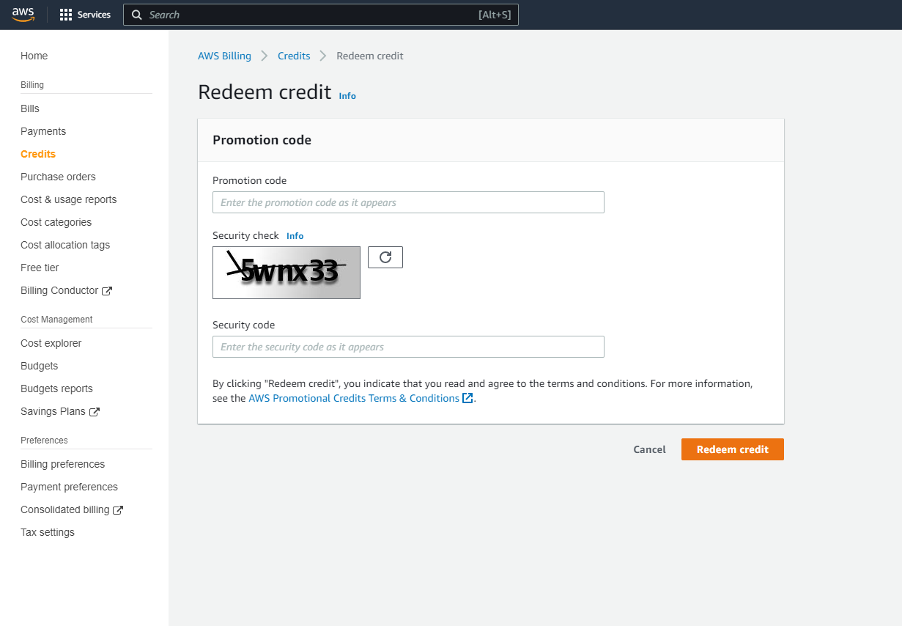

# ☁️ Prerequisites 

This workshop requires following applications and tools properly configured. Please follow the instruction provided on the links for each applications/tools.

## [Active AWS account]( https://aws.amazon.com/account/sign-up)

An active AWS account is necessary for this workshop as we will be provisioning EC2 instances. To obtain an account, you can visit the AWS website and [sign up](https://aws.amazon.com/account/sign-up) for a free account or login to [an existing AWS account.](https://console.aws.amazon.com/console/home)

## Apply AWS Promotional Credits

The AWS UG will present you credits for the workshop. You can add a promotional code to your AWS account by doing the following:

1. Open the Credits page of the Billing and Cost Management console.
1. Choose Redeem credit.
1. For Promotion code, enter the promotion code as it appears.
1. For Security code, enter the code shown in the CAPTCHA.
1. Choose Redeem credit.



> **Note**
> If the promotional code was entered correctly, is valid, hasn't expired, and hasn't been previously redeemed, it is added automatically to your AWS account.


## [Visual Studio Code](https://code.visualstudio.com/download) 

Visual Studio Code is a popular code editor developed by Microsoft. It supports multiple programming languages and has a wide range of extensions to enhance its functionality. To download Visual Studio Code, visit the [official website](https://code.visualstudio.com/download) and follow the instructions to install it on your machine.


## [Remote - SSH Extension](https://marketplace.visualstudio.com/items?itemName=ms-vscode-remote.remote-ssh)


The Remote - SSH Extension is a Visual Studio Code extension that allows you to connect to remote machines via SSH. This extension enables you to work with remote files, as well as run and debug code directly on the remote machine. To install this extension, go to the Visual Studio Code marketplace and search for "Remote - SSH" and follow the instructions to install it or click on the direct link.

Direct link for [Remote - SSH Extension](https://marketplace.visualstudio.com/items?itemName=ms-vscode-remote.remote-ssh)

## [Remote - SSH Extension: Editing Configuration Files](https://marketplace.visualstudio.com/items?itemName=ms-vscode-remote.remote-ssh-edit)

Remote - SSH: Editing Configuration files is an additional extension which allows you to edit the ssh configuration files directly from visual studio code. Download it using the following link [Remote - SSH: Editing Configuration Files](https://marketplace.visualstudio.com/items?itemName=ms-vscode-remote.remote-ssh-edit)


### Hardware requirements for Extension

You can connect to a running SSH server on the following platforms with the extension so make sure you're on supported operating systems: 

Supported:

1. x86_64 Debian 8+, Ubuntu 16.04+, CentOS / RHEL 7+ Linux.
1. ARMv7l (AArch32) Raspbian Stretch/9+ (32-bit).
1. ARMv8l (AArch64) Ubuntu 18.04+ (64-bit).
1. Windows 10 / Server 2016/2019 (1803+) using the official OpenSSH Server.
1. macOS 10.14+ (Mojave) SSH hosts with Remote Login enabled.
1. Other glibc based Linux distributions for x86_64, ARMv7l (AArch32), and ARMv8l (AArch64) should work if they have the needed prerequisites. See the Remote Development with Linux article for information prerequisites and tips for getting community supported distributions up and running.

While ARMv7l (AArch32) and ARMv8l (AArch64) support is available, some extensions installed on these devices may not work due to the use of x86 native code in the extension.

> **Note**
> While 1 GB RAM is required (similar to the hardware requirements for VS Code), at least 2 GB RAM and a 2-core CPU is recommended.

## Generate Public/Private Keys for CloudFormation 

To generate public and private keys for use with AWS CloudFormation, you can use the AWS Key Management Service (KMS) or a third-party tool such as OpenSSL or `ssh-keygen`. Here we will be using ssh-keygen and you can do it using the following command on your local machine:

```bash
ssh-keygen -t rsa -b 4096 -C "your_email@example.com" -f aws_key_pair
```

This command will generate a new RSA key pair with a length of 4096 bits, a comment containing your email address, and save the private key in a file named aws_key_pair and the public key in a file named aws_key_pair.pub in the current directory. You will be using the public key for CloudFormation!

The private key should be kept secret and should not be included in your CloudFormation template. You can use the private key to connect to the instances, but you should make sure to keep it safe and secure.


Now you're ready to go to [Step 2!](/step-2-create-ec2/) 🚀