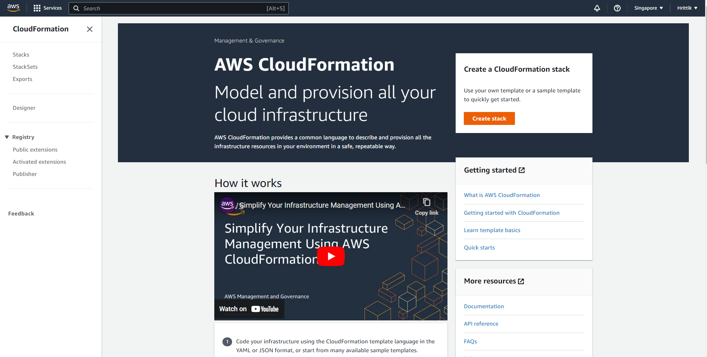
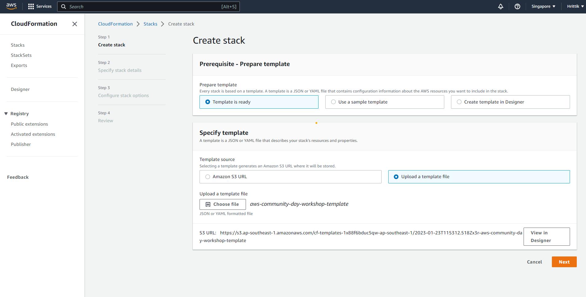
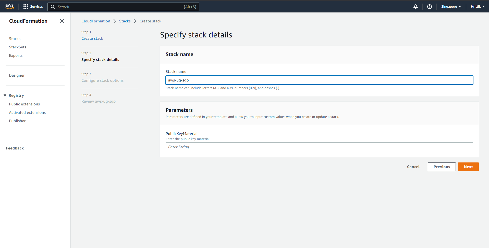
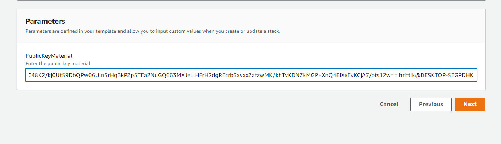
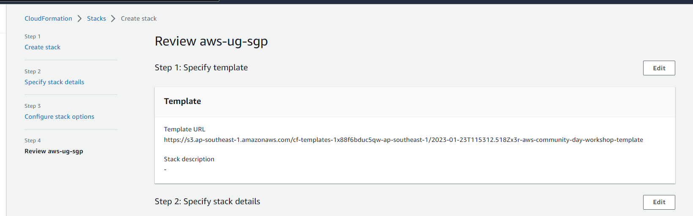
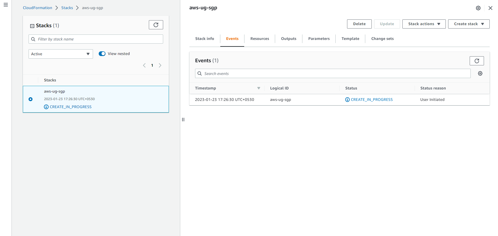
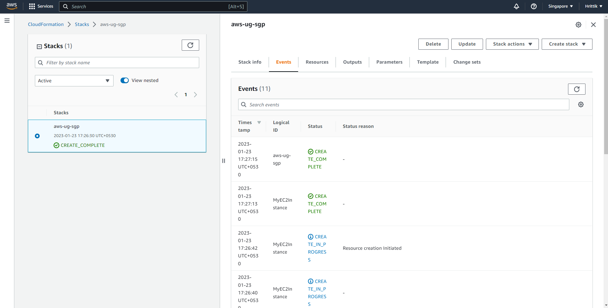
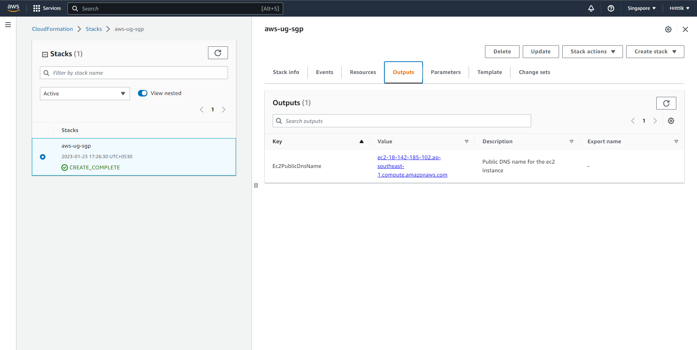

## CloudFormation Templates

AWS CloudFormation is a service that enables you to use templates to provision and manage AWS resources. It provides a simple and powerful way to create, update, and delete a collection of related AWS resources, known as a stack.

The Advantages of the service can be broken into 5 specific categories:

1. **Infrastructure as Code**: CloudFormation allows you to define your infrastructure as code, which means that you can version control your templates and automate the process of creating, updating, and deleting your stacks.

1. **Version Control**: You can use version control systems to track changes to your templates, making it easy to roll back to a previous version if necessary.

1. **Reusability**: You can reuse the same template to create multiple stacks, making it easy to replicate your infrastructure in different environments, such as development, staging, and production.

1. **Dependency Management**: CloudFormation automatically handles the dependencies between resources, ensuring that resources are created in the correct order and are fully configured before being used.

1. **Automated rollback**: CloudFormation supports automated rollback of changes made to a stack if it detects an error.

## Create an EC2 Stack

* Open your AWS Managament Console.

* Select Singapore Region for your resources

* Open the CloudFormation console in the AWS Management Console.

* Click on the "Create Stack" button.

* In step 1, Select "Upload a template file" as the template source!

* Click on the "Choose File" button and select the following template file [CloudFormation file](cloudformation-ec2-template) as a payload.

* Click on the "Next" button.

* Enter a stack name and any Public Key parameter values from the key you have generated in [Step 1](/step-1-prerequisites/).

* Click on the "Next" button.

* Configure any advanced options, such as tags or IAM roles. We will skip this as this is out of scope for this workshop so Skip to next section from Configure stack options using "Next"

* Click on the "Create Stack" button after reviewing your steps. The start should look similar: 

Wait a bit....

As the stack is created, you can view the outputs by going to the "Outputs" tab on the stack details page. The outputs are defined in the Outputs section of the template and can be used to reference resources created by the stack.

Copy the Ec2PublicDnsName value which here is `ec2-18-142-185-102.ap-southeast-1.compute.amazonaws.com` for [Step 3](/step-3-configure-vscode-ssh/)