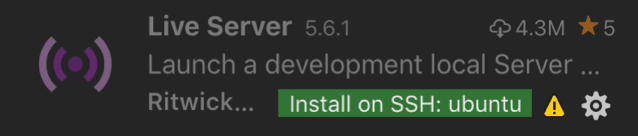

Once you have successfully set up the remote connection, you can do many things with it. The foour most fun things that users prefer range from testing, building and running applications!

## 🖼️ Install Extensions in SSH Session

Once you are connected to a remote host, you can install Visual Studio Code extensions directly on the remote host, without having to disconnect and install them locally. This allows you to maintain a consistent development environment across multiple machines.

Navigate to your extension and then use the Install in SSH button for VsCode while you're in the SSH Session! 

## ☸️ Building Application

The [/app](/app) directory has an application which we want to built and test in our remote enviroment to understand further steps! 

- Install Docker 

In order to build and run the application in a remote environment, you will need to have Docker installed on your machine. You can download and install Docker from the official website: https://www.docker.com/ or with help of an script 

- Clone this Repo

Once you have Docker installed, you will need to clone the repository containing the application. You can do this by running the command `git clone https://github.com/hrittikhere/workshop-ec2-vscode` in the terminal.

- Move to /app directory

After cloning the repository, navigate to the /app directory using the command `cd workshop-ec2-vscode/workshop-ec2-vscode/step-4-vscode-extras/app`

- Docker build
 
 Once you have verified that the Dockerfile is correct, you can build the application by running the command `docker build -t [image-name] .` in the terminal.

- Run Application

Finally, you can run the application by running the command `docker run -p [host-port]:[container-port] [image-name]` in the terminal. This will start the application and make it accessible on the specified host port.

## ⏩ Port Forwarding

You can also use the remote connection to forward a local port to a remote port, allowing you to access a service running on the remote host from your local machine. This can be useful for testing or debugging your application, as well as for accessing network resources that are not publicly accessible for temporary purpose.

Use Ports section to map a new port!

## 📂 File System Access

With the remote connection, you can access the file system of the remote host as if you were working directly on the machine. You can create, edit and delete files and directories, and use version control systems to manage your codebase.

Try uploading files to your remote server without any additional requirements!