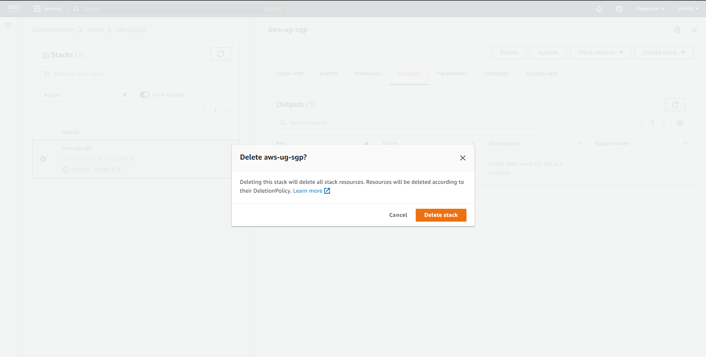

## Delete Resources 🧹
Using AWS CloudFormation can also help with the cleanup of resources, as you can easily delete an entire stack and all of its associated resources with a single command.

When you delete a stack, CloudFormation automatically deletes all of the resources that were created as part of the stack.

By using CloudFormation to manage your resources, you can be sure that all of the resources created by the stack are properly cleaned up when you delete the stack. This makes it easy to test and experiment with different configurations without leaving behind unwanted resources that can incur costs.

## Steps to clean 

The Step is simple as navigate to your CloudFromation Page and select the stack that you have created earlier. Click "Delete" on top right corner!

Click on "Delete Stack" and then confirm!

Your stack with all it's resources should be deleted now!🥳
